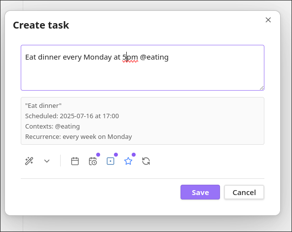
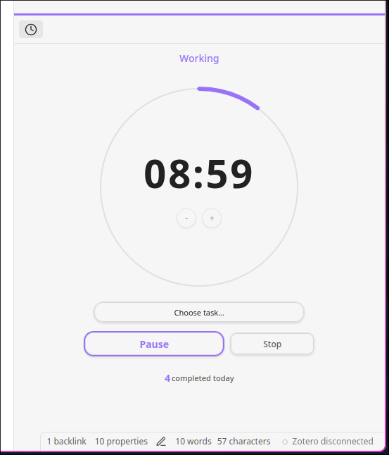
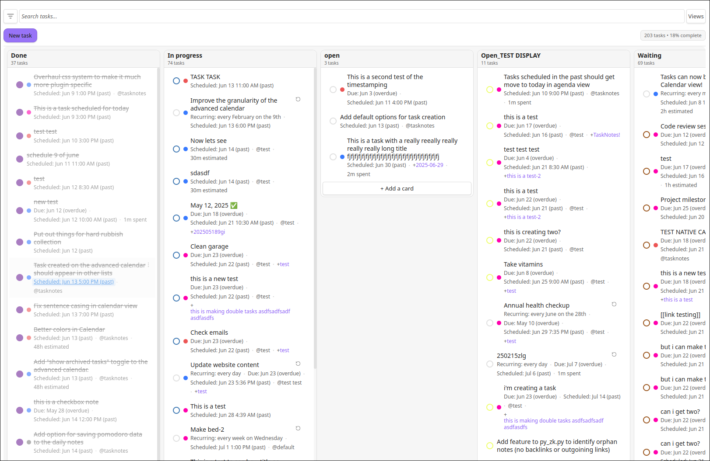
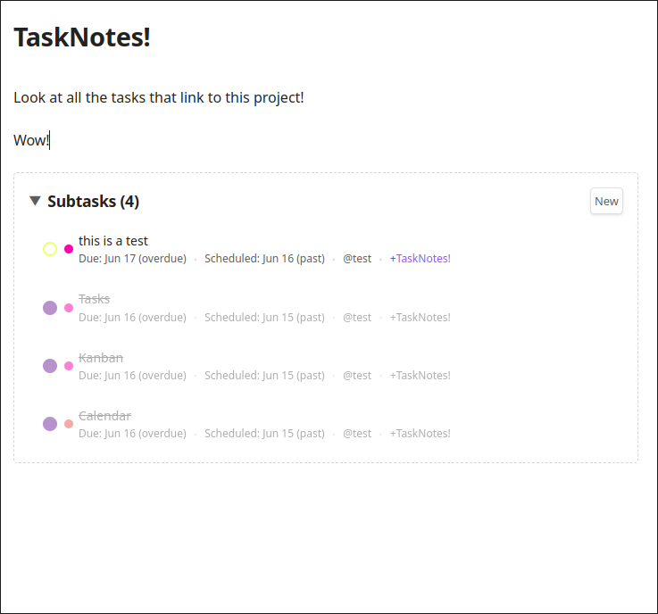

# TaskNotes for Obsidian

A task management plugin where each task is stored as an individual note using YAML frontmatter with calendar, kanban and pomodoro integration.


## Documentation

**[Documentation](https://callumalpass.github.io/tasknotes/)**

## Overview

TaskNotes treats each task as an individual Markdown file with YAML frontmatter containing the task's metadata (due date, status, priority, etc.) and the note body for additional context, descriptions, or progress notes. This creates a flexible system where tasks can be as simple or detailed as needed.

The plugin includes several views: calendar, kanban boards, filtered task lists, and a daily agenda. Tasks can link to projects using Obsidian's note linking. Recurring tasks track completion per instance.

You can track time on tasks with start/stop buttons and view session history. There's also a pomodoro timer that connects to tasks, with configurable work/break periods and stats.

## Rationale

Using YAML frontmatter for task storage has multiple benefits. YAML is a standard data format that works with many tools, so you can easily extract and transform your task data into other formats. This keeps your data portable and aligns with Obsidian's file-over-app philosophy.

The frontmatter is also extensible—you can add custom fields like "assigned-to" or "attachments" and use other tools like Obsidian Bases to work with that data. This flexibility made it easy to add features like time-tracking, which is tricky in other task formats where there's no obvious place to store timing information.

Since each task is a full note, you can write detailed descriptions, jot down thoughts as you work, and connect tasks to other notes through Obsidian's linking and graph features. The frontmatter compatibility with Bases also means you can use that plugin for different views and bulk operations if you want.

## Core Features

### Task Management
- Individual Markdown files with YAML frontmatter
- Properties: title, status, priority, due date, scheduled date, contexts, projects, tags, time estimates, completion date
- Project organization using note-based linking
- Recurring tasks with per-date completion tracking
- Time tracking with multiple sessions per task
- Archive function using tags 
- Filtering and grouping options

### Calendar Integration
- Month view displaying tasks and notes
- Mini calendar view for compact layouts
- ICS/iCal feed subscriptions
- Direct navigation to daily notes

### Time Management
- Time tracking with start/stop functionality
- Pomodoro timer with task integration
- Session history and statistics

### Editor Integration
- Interactive task previews for wikilinks
- Checkbox-to-task conversion
- Template support with parent note context

### Views
- **Calendar**: Month view with agenda
- **Task List**: Filtering and grouping options
- **Kanban**: Drag-and-drop task management
- **Agenda**: Daily task and note overview
- **Notes**: Date-based note browser
- **Pomodoro**: Timer with statistics


*Create tasks with natural language parsing for due dates, recurrence, and contexts*


*Built-in pomodoro timer with task integration and daily completion tracking*


*Kanban boards with drag-and-drop functionality and customizable columns*


*Project management with subtasks and hierarchical organization*

## Configuration

### Customization
- **Field Mapping**: Customize YAML property names to match existing workflows
- **Custom Statuses**: Define task statuses with colors and completion behavior
- **Custom Priorities**: Create priority levels with weight-based sorting
- **Templates**: Configure daily note templates with Obsidian variables

## YAML Structure

### Task Example
```yaml
title: "Complete documentation"
status: "in-progress"
due: "2024-01-20"
priority: "high"
contexts: ["work"]
projects: ["[[Website Redesign]]"]
timeEstimate: 120
timeEntries:
  - startTime: "2024-01-15T10:30:00Z"
    endTime: "2024-01-15T11:15:00Z"
```

### Recurring Task
```yaml
title: "Weekly meeting"
recurrence: "FREQ=WEEKLY;BYDAY=MO"
complete_instances: ["2024-01-08"]
```

## Credits

This plugin uses [FullCalendar.io](https://fullcalendar.io/) for its calendar components.

## License

This project is licensed under the MIT License - see the [LICENSE](LICENSE) file for details.
