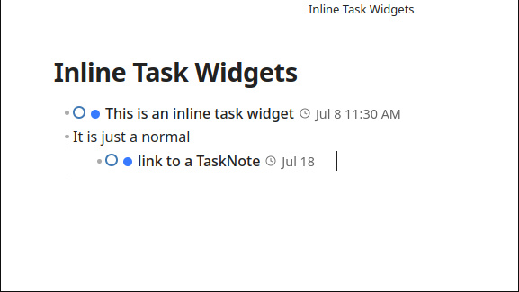
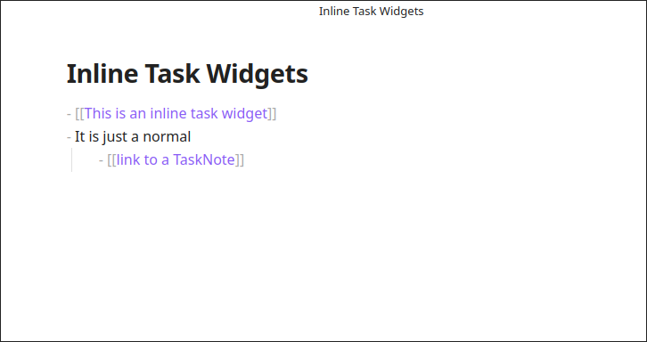

# Inline Task Integration

TaskNotes integrates with the Obsidian editor to allow task management directly within notes. This is achieved through interactive widgets, a conversion feature for checkboxes, and natural language processing.

## Task Link Overlays

When a wikilink to a task note is created, TaskNotes can replace it with an interactive **Task Link Overlay**. This widget displays information about the task, such as its status, priority, and due date. It also allows for actions like changing the status or priority, or opening the task for editing, directly from the note.

*Task link overlays in Live Preview mode show interactive widgets with status, dates, and quick actions*

*In Source mode, task links appear as standard wikilinks until rendered*

### Widget Features

The task link overlay displays:

- **Status Dot**: Clickable circular indicator showing current task status. Click to cycle through available statuses.
- **Priority Dot**: Color-coded indicator for task priority (only shown when assigned).
- **Task Title**: Displays the task name (truncated to 80 characters). Click to open the task edit modal.
- **Date Information**: Shows due dates (calendar icon) and scheduled dates (clock icon) with clickable context menus.
- **Recurrence Indicator**: Rotating arrow icon for recurring tasks with modification options.
- **Action Menu**: Ellipsis icon (shown on hover) provides additional task actions.

### Mode-Specific Behavior

Task link overlays work in both Live Preview and Reading modes:

- **Live Preview Mode**: Widgets hide when the cursor is within the wikilink range, allowing for easy editing.
- **Reading Mode**: Widgets display with full functionality and integrate with the reading mode typography.

The overlays support drag-and-drop to calendar views and provide keyboard shortcuts for quick navigation (Ctrl/Cmd+Click to open the source file).

## Instant Task Conversion

The **Instant Task Conversion** feature transforms standard Obsidian checkbox tasks into TaskNotes files. In edit mode, a "convert" button appears next to a checkbox task. Clicking this button creates a new task note using the checkbox's text as the title and replaces the checkbox with a link to the new task file.

## Project Subtasks Widget

The **Project Subtasks Widget** displays tasks that reference the current note as a project. When viewing a project note, the widget automatically appears and shows all tasks that link to that project, providing a consolidated view of project-related work.

The widget includes:

- **Collapsible Interface**: Click the widget title to expand or collapse the task list. The state is remembered between sessions.
- **Task Details**: Each task shows its status, priority, due date, and other properties.
- **Real-time Updates**: The widget updates automatically when tasks are added, modified, or deleted.
- **Smart Positioning**: The widget appears after frontmatter and properties but before the main note content.

The widget can be enabled or disabled in the plugin settings in the Misc tab under "Show project subtasks widget".

## Natural Language Processing

TaskNotes includes a **Natural Language Processor (NLP)** that parses task descriptions written in English to extract structured data. This allows for task creation from conversational language, such as "Prepare quarterly report due Friday #work high priority," which would automatically set the due date, tag, and priority.

The NLP engine supports syntax for:

-   **Tags and Contexts**: `#tag` and `@context` syntax.
-   **Priority Levels**: Keywords like "high," "normal," and "low".
-   **Status Assignment**: Keywords like "open," "in-progress," and "done".
-   **Dates and Times**: Phrases like "tomorrow," "next Friday," and "January 15th at 3pm".
-   **Time Estimates**: Formats like "2h," "30min," and "1h30m".
-   **Recurrence Patterns**: Phrases like "daily," "weekly," and "every Monday".

The NLP engine is integrated with the task creation modal. Typing a natural language description there will populate the corresponding fields.
