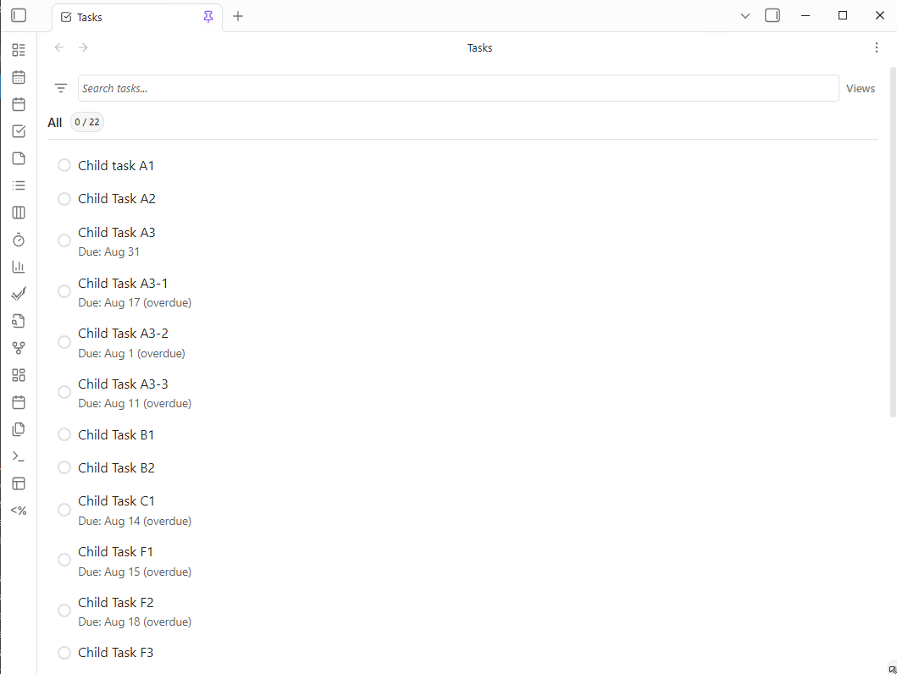
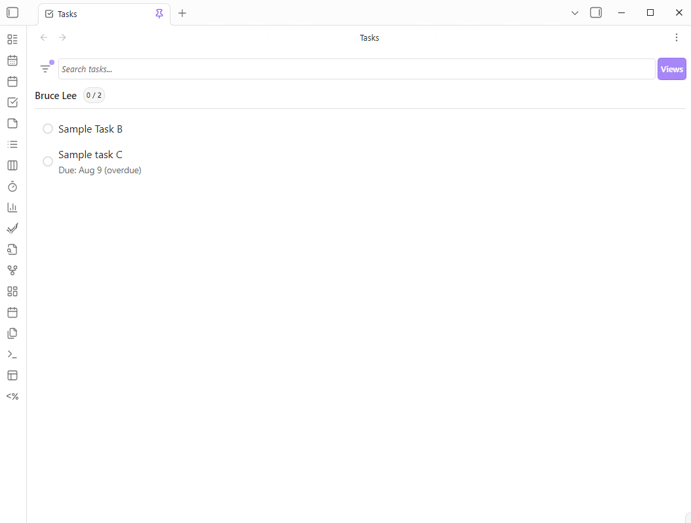

# Advanced Settings

These settings provide customization options, such as field mapping, custom status and priority workflows.

## Field Mapping

**Field Mapping** allows you to customize the YAML property names that TaskNotes uses for its internal properties. This can be used for integrating with other plugins or for matching your existing vault structure. You can map all of the core task properties, including title, status, priority, due date, contexts, and projects, as well as other properties like time estimates and recurrence patterns.

## User Fields

**User Fields** allow you to define custom frontmatter properties that appear as filterable options in all TaskNotes views. This feature enables you to extend TaskNotes with your own custom metadata while maintaining full filtering capabilities.

### Creating User Fields

1. Navigate to **Settings → Advanced → Field Mapping**
2. Scroll to the **User Fields** section
3. Click **Add field** to create a new custom property
4. Configure each field with:
   - **Property Name**: The frontmatter key (e.g., `effort`, `assignee`)
   - **Display Name**: How it appears in filter dropdowns (e.g., "Effort Level", "Assigned To")
   - **Type**: Data type that determines available filter operators

### Field Types

**Text**: For string values like names, descriptions, or categories
- Filter operators: is, is not, contains, does not contain, is empty, is not empty
- Example: `assignee: "John Smith"`

**Number**: For numeric values including mixed text-number formats
- Filter operators: is, is not, greater than, less than, equal or greater than, equal or less than, is empty, is not empty
- Example: `effort: 5` or `priority: "2-Medium"` (evaluates as number 2)

**Date**: For date values with natural language support
- Filter operators: is, is not, before, after, on or before, on or after, is empty, is not empty
- Example: `deadline: 2024-12-25` or `review_date: "next week"`

**Boolean**: For true/false values
- Filter operators: is checked, is not checked
- Example: `urgent: true`

**List**: For comma-separated values including wikilinks
- Filter operators: contains, does not contain, is empty, is not empty
- Example: `tags: "work, urgent"` or `related: "[[Project A]], [[Project B]]"`

### Smart List Filtering

User fields of type **List** support intelligent comma splitting that preserves:
- **Wikilinks**: `[[Health, Fitness & Mindset]], [[Nutrition]]` correctly splits into two items
- **Quoted text**: `"Focus, Deep Work", Notes` treats quoted content as single items
- **Mixed content**: Handles combinations of wikilinks, quotes, and plain text

### Numeric Field Intelligence

User fields of type **Number** can handle mixed text-number formats, making them perfect for priority systems:
- `"1-Low"` evaluates as number `1`
- `"2-Medium"` evaluates as number `2`
- `"3-High"` evaluates as number `3`

This allows filtering like "Priority greater than 1" to match "2-Medium" and "3-High" while excluding "1-Low".

### Instant Availability

User fields become available in filter dropdowns immediately after configuration - no plugin reload required. The fields appear in all TaskNotes views (Task List, Agenda, Kanban, Advanced Calendar) as soon as you save the settings.

### Technical Implementation

For developers interested in the technical details of User Fields implementation, see [User Fields Technical Documentation](../development/USER_FIELDS_TECHNICAL.md).

## Custom Status System

TaskNotes allows you to define your own **Custom Status Workflows**. You can create as many statuses as you need, and you can customize their names, colors, and completion behavior. You can also set the order in which the statuses appear, which determines the progression of the workflow.

## Custom Priority System

You can also create a **Custom Priority System**. You can define as many priority levels as you need, and you can customize their names, colors, and weights. The weight of a priority determines its importance, and is used for sorting and filtering.

## Pomodoro Timer Settings

You can configure the **Pomodoro Timer** from this section, including the duration of work and break sessions, as well as the notification settings. You can also choose where to store the Pomodoro session data.

### Time Tracking Auto-Stop

**Auto-stop time tracking on task completion** - Automatically stop active time tracking when any task is marked as completed. This ensures that time tracking accurately reflects the work done on tasks without requiring manual intervention. Enabled by default.

**Show notification when auto-stopping time tracking** - Display a notification when time tracking is automatically stopped due to task completion. This provides feedback when the auto-stop feature activates. Disabled by default to avoid notification clutter.

## Field Mapping

The Field Mapping section includes two additional fields for ICS integration:

**ICS Event ID** - Frontmatter field name for storing calendar event identifiers. Default is `icsEventId`. This field maintains the connection between vault content and calendar events.

**ICS Event Tag** - Tag used to identify content created from ICS events. Default is `ics_event`. This tag is automatically added to notes and tasks generated from calendar events.