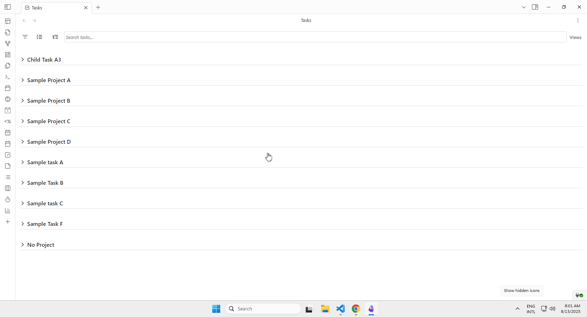

# Misc Settings

These settings control various plugin features and display options that don't fit into other categories.

## Saved Views button position

Choose where the Saved Views button appears in the FilterBar of supported views (Task List, Agenda, Kanban, Advanced Calendar):

- Right (default): Filter → Search → Saved Views
- Left: Saved Views → Filter → Search

This setting affects layout only; functionality is the same. See examples in Filtering and Views.

## Status Bar

**Show tracked tasks in status bar** - Display currently tracked tasks (with active time tracking) in the status bar at the bottom of the app. This provides a quick visual indicator of which tasks are currently being tracked without needing to open the TaskNotes views.

## Project Subtasks Widget

**Show project subtasks widget** - Display a collapsible widget showing all tasks that reference the current note as a project. This widget appears in the editor when viewing notes that have tasks referencing them as projects, providing quick access to related tasks.

## Task Display

**Hide completed tasks from overdue** - Control whether completed tasks appear as overdue in the agenda view. When enabled (default), completed tasks will not appear in the "Overdue" section of the agenda view, even if their due or scheduled date has passed. This setting affects task grouping and overdue detection throughout the plugin, helping keep overdue lists focused on actionable items.

## Subtask Chevron Position

Configure where the expand/collapse chevron appears on project task cards and in the Project Subtasks Widget.

- Right (default): The chevron appears on the right-hand side and shows on hover.
- Left (match group chevrons): The chevron appears on the left-hand side, always visible, matching group chevrons.

Demo:

## Performance Settings

**Disable note indexing** - Disable indexing and caching of non-task notes to improve performance in large vaults. Note: This will disable the Notes view and notes display in the Agenda view. Requires plugin restart to take effect.

This setting is useful for large vaults where performance may be impacted by indexing many notes. When enabled, TaskNotes will only index and track task files, which can significantly improve performance but will disable some features that depend on note content.