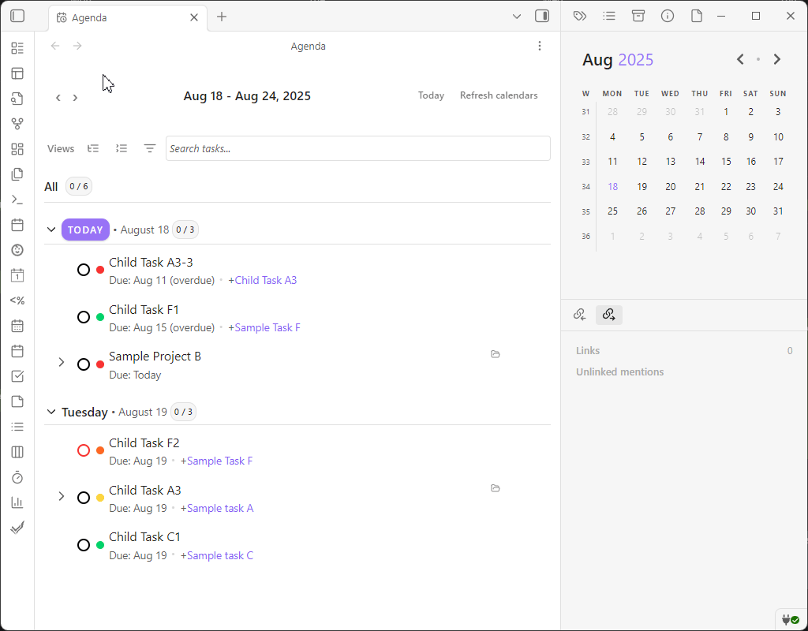

# Agenda View

The Agenda View displays a chronological list of tasks and notes, sorted by their due and scheduled dates.

## FilterBar Integration

The Agenda View includes the same FilterBar functionality as the Task List View, allowing you to filter, sort, and save views of your tasks. See the [Task List View](task-list.md) documentation for complete FilterBar functionality details.

### Saved view heading, counts, and collapsible groups

- The Agenda heading shows the saved view name with a completion count (completed / total), consistent with the Task List.
- Date groups are collapsible, with “Expand All” and “Collapse All” buttons always visible in the FilterBar top controls.
- Collapsed state is remembered between sessions.

## Content Organization

The Agenda View groups tasks and notes by time. The default groups are "Overdue," "Today," "Tomorrow," "This Week," "Next Week," and "Later." Within each group, items are sorted by priority.

## View Options

The Agenda View provides several display options that can be configured:

- **Show overdue on today**: When enabled, overdue tasks appear in the "Today" section alongside today's tasks
- **Show notes**: Controls whether daily notes are displayed alongside tasks in the agenda

These options are preserved when you save a view, allowing you to create saved views with specific display preferences that persist across sessions.

## Focus Features

The view provides controls for the date range and for the display of completed tasks. It also uses visual styling to distinguish overdue and high-priority items.